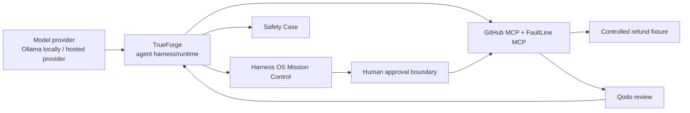

# Harness OS

> **Adversarial pre-deployment reliability engineering for autonomous agents.**

Harness OS crash-tests an AI agent **before deployment**, reproduces dangerous tool-level failure modes with deterministic evidence, proposes the smallest repair, keeps irreversible repository actions behind a human boundary, and projects the runtime evidence into a scoped Safety Case.

> **CI proves your code works. Harness OS proves your agent can be trusted to act when the real world behaves unexpectedly.**

## Live judge links

| Surface | URL | What it shows |
|---|---|---|
| **Judge Demo — Full Mission Control** | https://harshapriyag123.github.io/harness-os/judge-demo/ | Full local-style operator UI with Live Run, Evidence, Runtime Stack, Targets, Judge Demo guide and H-005 presenter flow |
| **Public Harness OS console** | https://harshapriyag123.github.io/harness-os/ | Read-only public landing console, H-005 evidence, architecture, agents, skills and tested queries |
| **Hosted TrueForge** | https://harness-os-trueforge.onrender.com | Dockerized TrueForge UI/runtime |
| **Harness OS cloud API** | https://harness-os-api-cloud.onrender.com | Public control-plane API index and docs |
| **Refund fixture** | https://harness-os.onrender.com/health | Authoritative controlled side-effect service |
| **FaultLine MCP** | https://faultline-h005.onrender.com/health | Deterministic timeout-after-success fault service |
| **Source / Qodo trail** | https://github.com/harshapriyag123/harness-os | Source, PR history and review evidence |

> Free Render services can cold-start after inactivity. The public judge console stays available on GitHub Pages while the services wake.

---

## Product visuals

### Mission Control — local operator experience

The local product keeps the active repository, TrueForge runtime, FaultLine bridge, evidence gates, causal trace and human brake in one operator surface.

### TrueForge agent library and instructions

The repository carries the TrueForge agent contract and git-backed skills used by the project. The public Mission Control exposes these under **Agents & Skills** so a judge can inspect the same configuration without relying on local browser state.

### TrueForge-centric architecture

### H-005 proof

---

## Architecture

**TrueForge is central.** It owns the agent loop, MCP orchestration, session/runtime state, sandbox capability and human checkpoints. Harness OS is the reliability/evidence control plane around it.

### Runtime responsibility boundary
